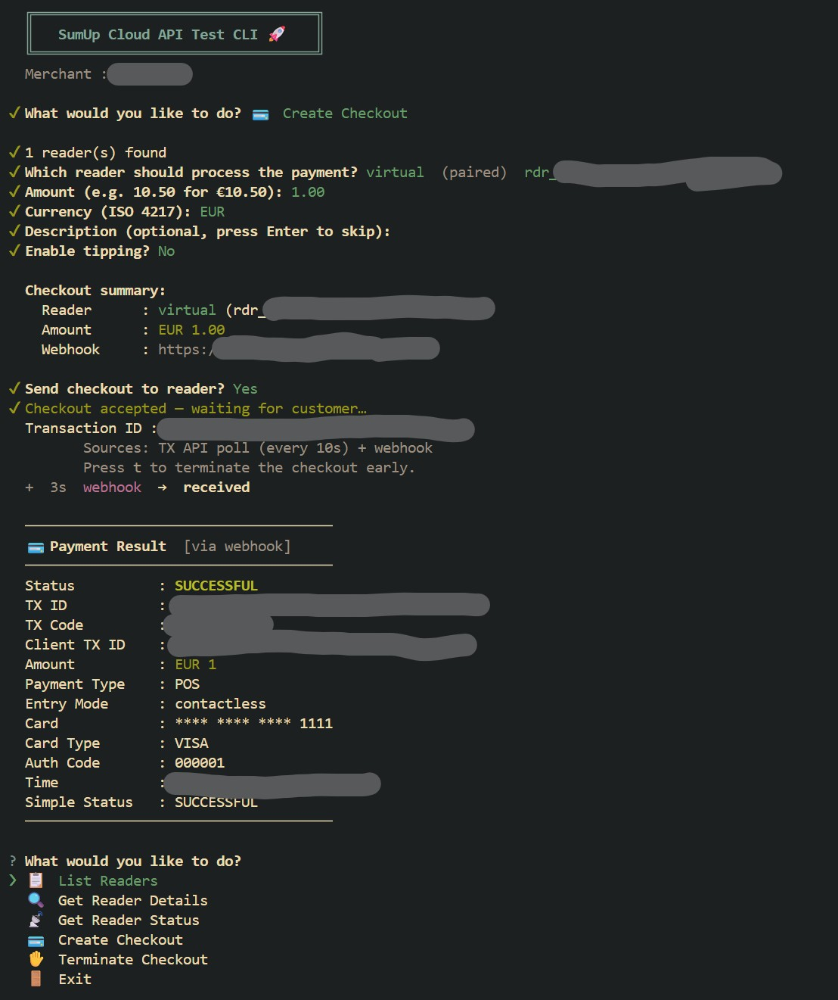
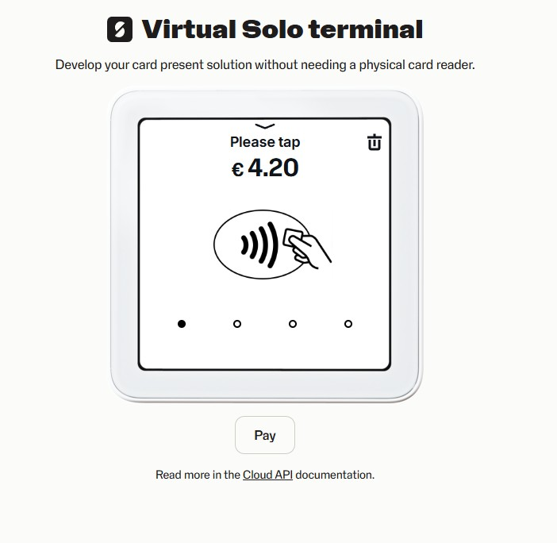

# sumup-cloudapi

Node.js tooling for testing the [SumUp Cloud API](https://developer.sumup.com/terminal-payments/cloud-api/) in sandbox mode.

Includes a **reusable library** (`src/lib/`) and an **interactive CLI** (`src/cli.js`) that covers the full checkout lifecycle — pairing, checkout, real-time result via webhook + transaction polling.

---

## Prerequisites

- Node.js 20+
- A SumUp sandbox merchant account — sign up at [developer.sumup.com](https://developer.sumup.com)
- A [Virtual Solo](https://virtual-solo.sumup.com) or physical Solo reader paired to that account
- A publicly reachable HTTPS endpoint for webhooks (see [Webhook Setup](#webhook-setup) below)

---

## Setup

```bash
git clone <repo>
cd sumup-cloudapi
cp .env.example .env   # fill in your values
npm install
```

### Environment variables

| Variable | Required | Description |
|---|---|---|
| `SUMUP_API_KEY` | ✅ | Personal access token from [developer.sumup.com](https://developer.sumup.com) |
| `SUMUP_MERCHANT_CODE` | ✅ | Your sandbox merchant code (e.g. `M1234567`) |
| `SUMUP_AFFILIATE_KEY` | ✅ | From the **Affiliate Keys** page in the developer portal |
| `SUMUP_APP_ID` | ✅ | Application ID from the Affiliate Keys page (reverse-domain string) |
| `WEBHOOK_PORT` | ☑️ | Local HTTP port for the embedded webhook listener (default: `58180`) |
| `WEBHOOK_URL` | ☑️ | Public HTTPS URL SumUp POSTs transaction results to (see below) |

---

## Running the CLI

```bash
npm start
```

The CLI presents a persistent menu:



```
  ╔══════════════════════════════════╗
  ║   SumUp Cloud API Test CLI 🚀    ║
  ╚══════════════════════════════════╝
  Merchant : M1234567

? What would you like to do?
❯ 📋  List Readers
  🔍  Get Reader Details
  📡  Get Reader Status
  💳  Create Checkout
  ✋  Terminate Checkout
  🚪  Exit
```

### Create Checkout flow

1. Select a paired reader from the live list
2. Enter amount, currency, optional description, optional tipping
3. Confirm — the CLI starts an embedded HTTP server and sends the checkout
4. The reader prompts the customer for card presentation
5. SumUp POSTs the result to `WEBHOOK_URL` **and** the CLI polls the Transactions API every 10 seconds in parallel
6. Whichever resolves first wins the race; the full transaction record is displayed:

```
  ─────────────────────────────────────
  💳 Payment Result  [via poll]
  ─────────────────────────────────────
  Status          : SUCCESSFUL
  TX ID           : 00000000-0000-0000-0000-000000000000
  TX Code         : TAAA11AAAAA
  Client TX ID    : 11111111-1111-1111-1111-111111111111
  Amount          : EUR 1
  Payment Type    : POS
  Entry Mode      : contactless
  Card            : **** **** **** 1111
  Card Type       : VISA
  Auth Code       : 000001
  Time            : 2026-07-08T00:00:00.000Z
  Simple Status   : SUCCESSFUL
  ─────────────────────────────────────
```

> If the webhook arrives first it is immediately enriched by a TX API call so the output is identical either way.

### Architecture: Transaction Resolution Strategy

Getting real-time transaction updates from hardware payment terminals is tricky because network connectivity (especially on cellular readers) can drop at any moment.

To guarantee you see the result as fast as possible without missing events, the CLI implements a **concurrent resolution strategy** using a `Promise.race`:

1. **Webhook Listener**: The CLI runs an HTTP server on `WEBHOOK_PORT`. When you send a checkout, its ID is registered in a global waiting list. When SumUp `POST`s the envelope to your webhook URL, the server matches the transaction ID and resolves it. This is usually the fastest path.
2. **Long-polling Fallback**: In parallel, the CLI polls the Transactions API (`GET /v2.1/merchants/...`) every 10 seconds. If the webhook fails to deliver (e.g. your local port-forwarding dropped, or an edge-case timeout occurred), the poll guarantees the transaction status is still caught and resolved.
3. **Graceful Abort**: The `Promise.race` uses an `AbortController`. Whichever method resolves the transaction first sends an abort signal to the *loser*, cleanly tearing down interval timers and removing the checkout from the waiting list to prevent duplicate state updates.


---

## Webhook Setup

The CLI embeds a plain HTTP listener on `127.0.0.1:WEBHOOK_PORT`. You need nginx (or equivalent) on a public server to terminate TLS and proxy requests to it.

### nginx config

A ready-to-use nginx server block is included at [`webhook.example.com.nginx.conf`](./webhook.example.com.nginx.conf). Adapt the `server_name` and cert paths for your domain:

```nginx
server {
    listen      443 ssl;
    server_name webhook.example.com;

    ssl_certificate     /etc/letsencrypt/live/webhook.example.com/fullchain.pem;
    ssl_certificate_key /etc/letsencrypt/live/webhook.example.com/privkey.pem;

    location /webhook {
        proxy_pass http://127.0.0.1:58180;
        proxy_set_header Host              $host;
        proxy_set_header X-Real-IP         $remote_addr;
        proxy_set_header X-Forwarded-For   $proxy_add_x_forwarded_for;
        proxy_set_header X-Forwarded-Proto $scheme;
    }

    location /health {
        proxy_pass http://127.0.0.1:58180;
    }

    location / { return 404; }
}
```

After reloading nginx the CLI's embedded listener handles the incoming POST automatically.

---

## Library

Import from `src/lib/index.js` to reuse the API wrappers in your own scripts:

```js
import {
  listReaders,
  getReader,
  getReaderStatus,
  createCheckout,
  terminateCheckout,
  getTransaction,
} from './src/lib/index.js';

// List paired readers
const readers = await listReaders();

// Start a checkout
const result = await createCheckout(readerId, {
  value: 1000,       // EUR 10.00 — amount in minor units
  currency: 'EUR',
  description: 'Test payment',
  returnUrl: 'https://your-domain.example.com/webhook',
});
console.log(result.client_transaction_id);

// Poll for result
const tx = await getTransaction({ clientTransactionId: result.client_transaction_id });
console.log(tx.status, tx.amount, tx.currency);
```

### API surface

| Function | Description |
|---|---|
| `listReaders()` | List all readers paired to the merchant |
| `getReader(id)` | Retrieve a single reader |
| `getReaderStatus(id)` | Battery, connectivity, and device state |
| `createCheckout(id, opts)` | Start a checkout — affiliate metadata auto-injected |
| `terminateCheckout(id)` | Cancel the active checkout on a reader |
| `getTransaction(query)` | Retrieve a transaction by `id`, `clientTransactionId`, `transactionCode`, or `foreignTransactionId` |

---

## Keeping dependencies up to date

```bash
npm run ncu      # preview available updates
npm run update   # apply updates and reinstall
```

---

## Pairing a Virtual Reader



1. Go to [virtual-solo.sumup.com](https://virtual-solo.sumup.com) and log in with your sandbox merchant account
2. On the Virtual Solo screen go to **Connections → API → Connect** — a pairing code appears
3. Use the SumUp developer portal or the API to pair the reader with that code
4. The reader will then appear in **List Readers** in the CLI

